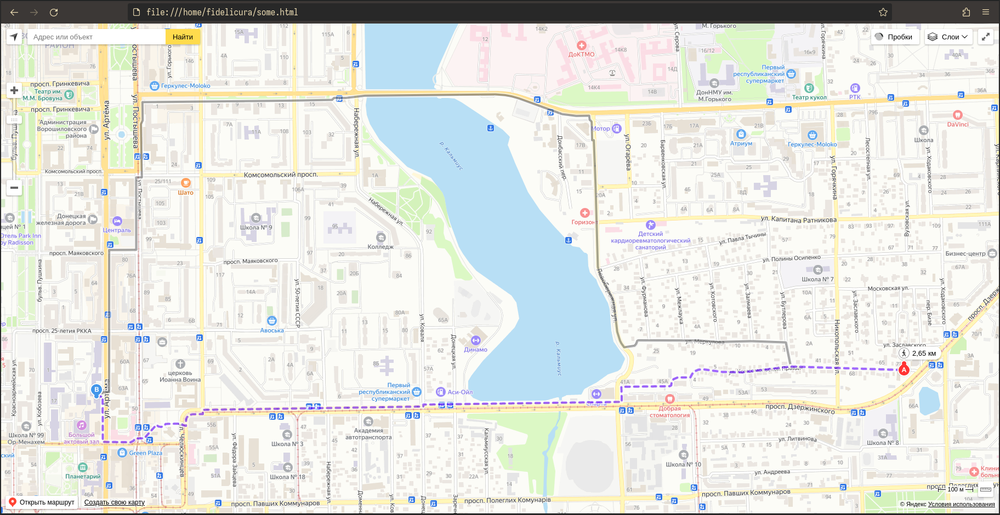
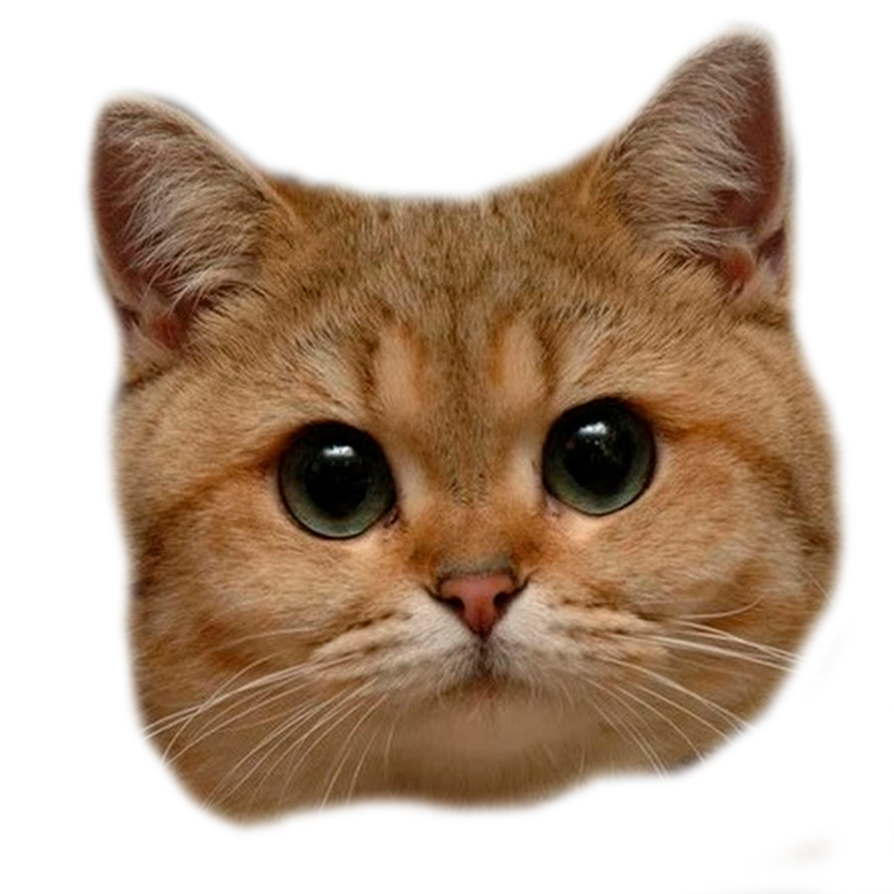

Доклады
---

Мои доклады на темы:
- "Мой путь в информационно-компьютерные технологии" занял 3 страницы формата А4;
- "Мои представляния о прошлом и будущем вычислений" занял 7 страниц формата А4;
- "Мои идеи и проекты, которые я хотел бы реализовать в будущем" занял 3 страницы формата А4;

Из основных выдвиженных мною идей, я планирую написать:
- TUI менеджер входа в систему для `Void Linux` на основе библиотеки `ncurses` - крайне полезная вещь, так как автор оригинальной идеи забросил свой проект из-за недостаточного финансирования;
- CLI утилита для визуализации степени зависимости и абстракции классов, а также степень когерентности кода по Роберту Мартину - интересный проект с возможностями парсинга исходного кода в формате AST для анализа метрических характеристик кода как исчисления;
- Простейший модуль ядра Linux на функциональном языке `Haskell` - необычный проект, цель которого проверить противоречивость написания чистым функциональным языком решения задач императивного формата;

<!-- end_slide -->
Формула
---

Формулы... формулы. Я взял довольно простую, но интересную по концепции реализации формулу - N-ное число Фибоначчи.
Код выглядит следующим образом:
```js
function fibonacci(n) {
  return n <= 1 ? n : fibonacci(n - 1) + fibonacci(n - 2);
}

alert(fibonacci(10));
```

Демонстрационный вариант (язык `Bash`):
```bash +exec
function fib() {
  local n=$1
  local x=0
  local prev1=0
  local prev2=0
  local cur=0
  for (( x = 1 ; x <= n ; x++ ))
  do
    if [[ $x == 1 || $x == 2 ]] ;  then
      prev1=1
      prev2=1
      cur=1
      continue
    fi
    cur=$(( prev1 + prev2 ))
    prev2=$prev1
    prev1=$cur
  done
  echo "Ответ: $cur"
}

fib 10
```

<!-- end_slide -->
Путь (код)
---

Путь от дома до университета было построить не так уж и сильно сложно, но разобраться в API Яндекс.Карты было не так уж и просто.
Исходный код:
```js
function init() {
    var pointA = [47.996472, 37.804233],
        pointB = [47.994061, 37.804125],
        multiRoute = new ymaps.multiRouter.MultiRoute({
            referencePoints: [
                pointA,
                pointB
            ],
            params: {
                routingMode: 'pedestrian'
            }
        }, {
            boundsAutoApply: true
        });
    var myMap = new ymaps.Map('map', {
        center: [47.994159, 37.804150],
        zoom: 12,
    });
    myMap.geoObjects.add(multiRoute);
}

ymaps.ready(init);
```

>Результат кода на следующем слайде.

<!-- end_slide -->



<!-- end_slide -->
Игра
---
<!-- column_layout: [2, 1] -->

<!-- column: 0 -->
Как по затратам мыслительных ресурсов, так и времени, больше всего заняла игра.
Игра довольно проста: у нас есть кот, который бегает по экрану влево-вправо (мы им управляем) и который ловит фрукты.
У игры есть конец - после сбора 1000 фруктов, вы побеждаете.
Проиграть нельзя, так как **кот очень прожорливый**.

```rust
#[derive(Debug, Component)]
pub(crate) struct FruitSpawner;

impl FruitSpawner {
    pub(crate) fn setup(
        commands: Commands,
        time: Res<Time>,
        asset_server: Res<AssetServer>
    ) {
        if time.elapsed_seconds() >= unsafe { FRUIT_SPAWN_TIME } {
            Fruit::setup(commands, asset_server);
            unsafe { FRUIT_SPAWN_TIME += 2. }; // ай-ай-ай
        }
    }
}
```

<!-- column: 1 -->


>Видео-демонстрация игры в отдельном слайде.

<!-- reset_layout -->

<!-- end_slide -->
Внимание
---

Спасибо за внимание! ❤️
